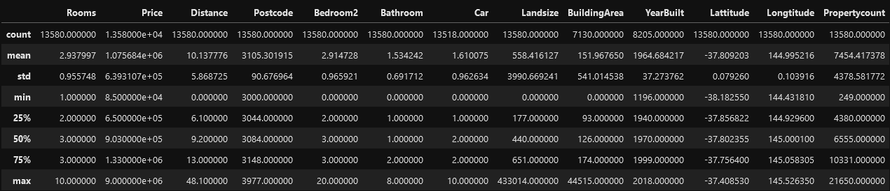

# Basic Data Exploration

Created: June 6, 2022 5:05 PM
Materials: data/melb_data.csv
Module: 2
URL: https://www.kaggle.com/code/dansbecker/basic-data-exploration

### Using Pandas

First step in ML → Get familiar with the data

We’ll use [pandas](https://pandas.pydata.org) library

### DataFrame

- Can be considered as the most important part of Pandas
- A DataFrame holds the type of data that could be considered as a table
    - Similar to a sheet in Excel, or a table in SQL database

### Dataset to be used

[Melbourne Housing Snapshot | Kaggle](https://www.kaggle.com/datasets/dansbecker/melbourne-housing-snapshot)

### View the dataset snapshot

```python
import pandas as pd

# Melbourne housing data .csv file path
melbourne_filepath = './data/melb_data.csv'

# Read and store the data in DataFrame
melbourne_data = pd.read_csv(melbourne_filepath);

# Print a summary of the data
melbourne_data.describe()
```

**Output**

