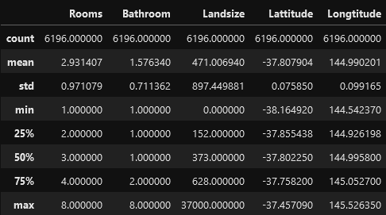

# First ML Model

Created: June 6, 2022 6:13 PM
Module: 3
URL: https://www.kaggle.com/code/dansbecker/your-first-machine-learning-model

### Selecting data for modelling

- As there are too many variables, we’ll start by picking some variables using intuition
- To choose variables/columns, we’ll need to see a list of all columns in the database
*continued from the previous module*
    
    ```python
    melbourne_data.columns
    ```
    
- To drop missing values in a dataset
    
    ```python
    melbourne_data = melbourne_data.dropna(axis=0)
    ```
    
- There are many ways to select a subset from the data
    - Dot notation
        - Use it to select the “prediction target”
    - Selecting with a column list
        - Use it to select the “features”

### Selecting the prediction target

- We can pull out a variable with dot-notation
- The single column is stored in a **“Series”**
    - It is broadly like a DataFrame with only a single column of data
- **Prediction Target** → Column selected using dot notation which we want to predict
    - By convention, prediction target is called **y**
    
    ```python
    y = melbourne_data.Price
    ```
    

### Choosing “features”

- **“Features”** → The columns that are inputted into our model (and later used to make predictions)
    - In this case, those would be the columns used to determine the home price
- We select multiple features by providing a list of column names inside brackets
    - Each item in that list should be a string (with quotes)
    
    ```python
    melbourne_features = ['Rooms', 'Bathroom', 'Landsize', 'Lattitude', 'Longtitude']
    ```
    
- By convention, this data is called **X**
    
    ```python
    X = melbourne_data[melbourne_features]
    ```
    
    ```python
    X.describe()
    ```
    
    
    
    ```python
    X.head()
    ```
    
    
    

### Building your Model

- We’ll be using **[scikit-learn](https://scikit-learn.org)** library to create models
    - Usually written as `sklearn` in coding
- Steps in building and using a model are:
    - **Define** → What type of model will it be? A decision tree? Some other type of model? Some other parameters of the model type are specified too
    - **Fit** → Capture patterns from provided data (This is the heart of modelling)
    - **Predict**
    - **Evaluate** → Determine how accurate the model’s prediction are
    
    ```python
    from sklearn.tree import DecisionTreeRegressor
    
    # Define model. Specify a number for random_state to ensure same results each run
    melbourne_model = DecisionTreeRegressor(random_state=1)
    
    # Fit model
    melbourne_model.fit(X, y)
    ```
    


- Many ML models allow some randomness in model training
    - Specifying a number for `random_state` ensures we get the same results in each run
- We now have a fitted model that we can use to make predictions
    
    ```python
    print('Making predictions for the following 5 houses:')
    print(X.head())
    
    print('The predictions are ...')
    print(melbourne_model.predict(X.head()))
    ```
    
    