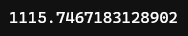

# Model Validation

Created: June 6, 2022 8:01 PM
Module: 4
URL: https://www.kaggle.com/code/dansbecker/model-validation

### What is Model Validation?

- In most applications, not all, the relevant measure of model quality is predictive accuracy
    - Simply put, will the model’s predictionsbe close to what actually happens
- A big mistake people make is
    - They make predictions with their training data
    - Then compare those predictions to the target values in the training data itself
- We first need to summarize the model quality in an understandable way
- There are many metrics for summarizing model quality
    - **Mean Absolute Error (MAE)**
        - The prediction error for each house is
            
            ```python
            error = actual - predicted
            ```
            
        - So, if a house costs $150,000 and we predicted it would cost $100,000, the error is $50,000
        - With MAE metric, we take the absolute value of each error
            - This converts the error into a positive number
            - We then take the average of these errors
            - This is our measure of model quality
            - In plain english …
                
                > On average, our predictions are off by about X
                > 

---

**To calculate MAE, we first need a model**

```python
# Data Loading Code Hidden Here
import pandas as pd

# Load data
melbourne_file_path = '../input/melbourne-housing-snapshot/melb_data.csv'
melbourne_data = pd.read_csv(melbourne_file_path) 

# Filter rows with missing price values
filtered_melbourne_data = melbourne_data.dropna(axis=0)

# Choose target and features
y = filtered_melbourne_data.Price
melbourne_features = ['Rooms', 'Bathroom', 'Landsize', 'BuildingArea', 
                        'YearBuilt', 'Lattitude', 'Longtitude']
X = filtered_melbourne_data[melbourne_features]

from sklearn.tree import DecisionTreeRegressor

# Define model
melbourne_model = DecisionTreeRegressor()

# Fit model
melbourne_model.fit(X, y)
```

**Once we have a model, this is how we calculate the mean absolute error**

```python
from sklearn.metrics import mean_absolute_error

predicted_home_prices = melbourne_model.predict(X)
mean_absolute_error(y, predicted_home_prices)
```



### Splitting the dataset

- scikit-learn library has a function `train_test_split` to break up the data into two pieces
    - We use some of that data as training data to fit the model
    - We use other part of the data as validation data to calcualte `mean_absolute_error`
    
    ```python
    from sklearn.model_selection import train_test_split
    
    # split data into training and validation data, for both features and target
    # The split is based on a random number generator. Supplying a numeric value to
    # the random_state argument guarantees we get the same split every time we
    # run this script.
    train_X, val_X, train_y, val_y = train_test_split(X, y, random_state = 0)
    # Define model
    melbourne_model = DecisionTreeRegressor()
    # Fit model
    melbourne_model.fit(train_X, train_y)
    
    # get predicted prices on validation data
    val_predictions = melbourne_model.predict(val_X)
    print(mean_absolute_error(val_y, val_predictions))
    ```
    
    