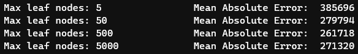

# Underfitting and Overfitting

Created: June 7, 2022 11:01 AM
Module: 5
URL: https://www.kaggle.com/code/dansbecker/underfitting-and-overfitting

### Experimenting with different models

- A tree’s depth is a measure of how many splits it takes before coming to a prediction
- A relatively shallow tree
    
    
    
- In practice, it’s not uncommon for a tree to have 10 splits between the top level (all houses) and a leaf
- As the tree gets deeper, the dataset gets sliced up into leaves and fewer houses
    - If a tree had only 1 split, it divides the data into 2 groups
        - If each group is split again, we would get 4 groups of houses
            - Splitting each of these would create 8 groups
    - If we keep doubling the groups by adding splits at each level, we’ll have $2^{10}$ groups of houses by the time we reach $10^{th}$ level
        - That’s 1024 leaves
- When we divide the houses amongst many leaves, we also have fewer houses in each leaf
- Leaves with very few houses will make predictions that are quite close to those homes’ actual values
    - But, they make very unreliable predictions for new data
        - As each prediction is based on very few houses
- This is **overfitting**
    - The model matches the training data almost perfectly, but does poorly on validation and other new data
    - On the flipside, it we make our tree very shallow, it doesn’t divide up the houses into very distinct groups
- At an extreme, if a tree divides houses into only 2 or 4, each group still has a wide variety of houses
- Resulting predictions may be far off for most houses, even in the training data
- When a model fails to capture important distinctions and patterns in the data, so it performs poorly even in training data, that is **underfitting**


### Example

- There are a few alternatives for controlling the tree depth
    - Many allow for some routes through the tree to have greater depth than other routes
- `max_leaf_nodes` argument provides a very sensible way to control overfitting vs underfitting
- The more leaves we allow the model to make, the more we move from underfitting area to overfitting area (above graph)

```python
from sklearn.metrics import mean_absolute_error
from sklearn.tree import DecisionTreeRegressor

def get_mae(max_leaf_nodes, train_X, val_X, train_y, val_y):
    model = DecisionTreeRegressor(max_leaf_nodes=max_leaf_nodes, random_state=0)
    model.fit(train_X, train_y)
    preds_val = model.predict(val_X)
    mae = mean_absolute_error(val_y, preds_val)
    return(mae)
```

We can use a for-loop to compare the accuracy of models built with different values for `max_leaf_nodes`

```python
# compare MAE with differing values of max_leaf_nodes
for max_leaf_nodes in [5, 50, 500, 5000]:
    my_mae = get_mae(max_leaf_nodes, train_X, val_X, train_y, val_y)
    print("Max leaf nodes: %d  \t\t Mean Absolute Error:  %d" %(max_leaf_nodes, my_mae))
```



*Of the options listed, 500 is the optimal number of leaves*

### Conclusion

Here’s the takeaway; Models can suffer from either:

- **Overfitting** → Capturing spurious patterns that won’t recur in the future, leading to less accurate predictions
- **Underfitting** → Failing to capture relevant patterns, again leading to less accurate predictions

We use validation data, which isn’t used in model training, to measure a candidate model’s accuracy

This lets us try many candidate models and keep the best one