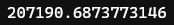

# Random Forests

Created: June 7, 2022 12:37 PM
Module: 6
URL: https://www.kaggle.com/code/dansbecker/random-forests

### Introduction

- Decision trees leave us with a difficult decision
    - A deep tree with lots of leaves will overfit because each prediction is coming from historical data from only the few houses at its leaf
    - A shallow tree with few leaves will perform poorly because it fails to capture as many distinctions in the raw data
- Random forest uses many trees, and it makes a prediction by averaging the predictions of each component tree
- It generally has much better predictive accuracy than a single decision tree and it works well with default parameters

### Example

We build a random forest model similarly to the way we built decision tree in scikit-learn using `RandomForestRegressor` instead of `DecisionTreeRegressor`

```python
from sklearn.ensemble import RandomForestRegressor
from sklearn.metrics import mean_absolute_error

forest_model = RandomForestRegressor(random_state=1)
forest_model.fit(train_X, train_y)
melb_preds = forest_model.predict(val_X)
print(mean_absolute_error(val_y, melb_preds))
```



### Conclusion

- There is more room for improvement, but this is a big improvement over the best decision tree error of 250,000
- There are parameters that will allows us to change the performance of the Random Forest much as we changed the max depth of the single decision tree
- But, one of the best features of Random Forest is that they generally work reasonably well even without this tuning